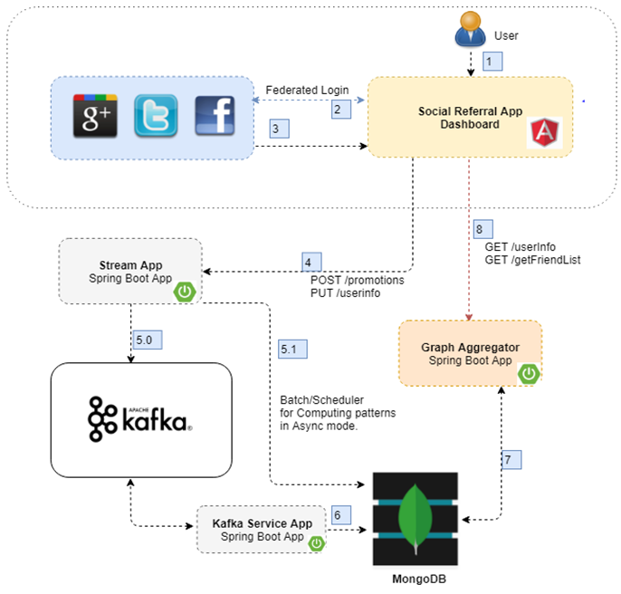

# Social Referral App

This app is a social referral app with front end on Angular and backend on Spring boot with persistence based on Mongo DB.
Objectives out of this solution is:

## Set up friend invite referral program
* User is going to login to our app using federated login option (Facebook / Twitter / Google).
* Once logged in, Invite all your friends for a (new product/business/e-commerce/retail website launch/video, online library(Netflix/Amazon prime etc.)).
* All the promotion information / offers will be pre-stored in MongoDB collections.
* User can refer the promotion of his choice in FB / Google+. His friends can click on the referral promotion and will be redirected to the Social Referral    website to redeem that coupon.
* After accepting the invite / offer, each login of your friend gets a reward of coupons/amount/points.Based on user sharing, that friend becomes your follower as soon as he signup/purchases anything online.
* On completion of your target(10/20/50/100 points)you will become prime member/get membership/offers/discounts/coupons from that retailer/e-commerce website.
* A badge system would be established to show the number of referrals made by user / referrals converted into actual buy and so on.
* Recommendation based on likes/comments (for this product/website) can be added as part of enhancement to this program.
* Graph capabilities would be shown based on you referral count/mutual friends/followers (friends joined to website after referral)/recommendations/likes/comments etc.

## Solution Architecture

## Tech Stack
* Java 8
* Spring Boot 2
* Apache Kafka
* Spring Social
* Spring Security
* MongoDB
* GraphQL
* D3 Charts JS
* WebSockets
* Angular 5
* Netty
* Facebook / Twitter / Google+ APIs
